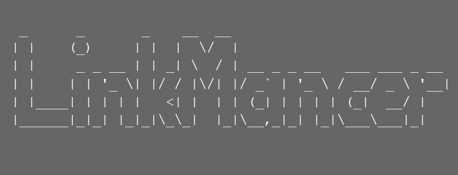

# LinkMancer

### IMPORTANT
Currently, all the work is focused on the LinkMancer's reactive version: https://github.com/RomaKudryavtsev/java-linkmancer-reactive
Check it out!

### Project description
With LinkMancer, you will never be annoyed by a bunch of links opened in your browser!

LinkMancer is a simple and intuitive tool for organizing and sharing your bookmarks. 

With LinkMancer, you can easily save, categorize, and manage links to your favorite websites, articles, and resources. The app features a clean and modern user interface, customizable categories, and search functionality. LinkMancer is perfect for anyone who wants to keep their bookmarks organized and accessible from any device.

### Tech stack
REST service using Spring Framework, Maven, and interaction with the PostgreSQL database via an ORM framework (Hibernate).

### System requirements
- JVM installed
- PostgreSQL database is created using any Postgre client (e.g., pgAdmin 4)